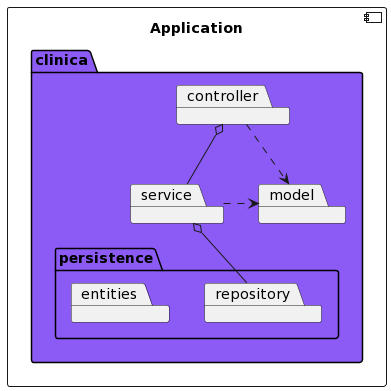
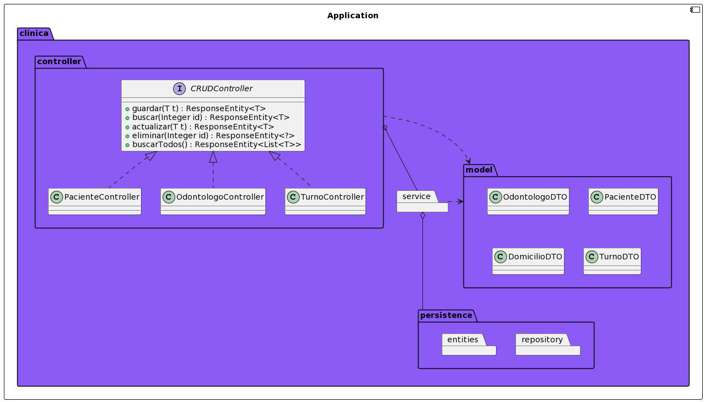
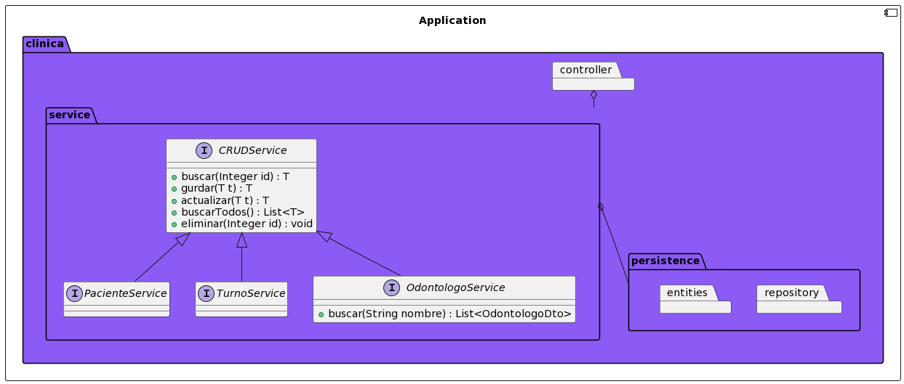
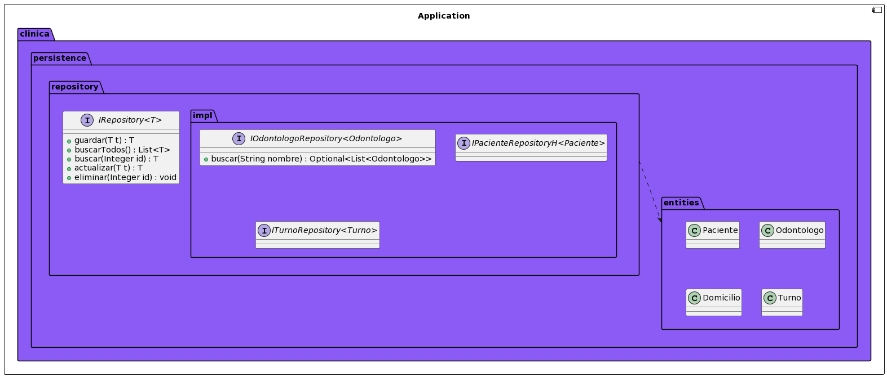

[![Build Status][build-shield]][build-url]
[![Codacy Status][codacy-shield]][codacy-url]

# CTD-BE1 - Proyecto Integrador: Clínica Odontológica

El proyecto es una API REST de una clínica odontológica en proceso.

Como la vista todavía es un trabajo en proceso, dejo el archivo `clinica-odontologica.postman_collection` donde están las pruebas realizadas desde Postman con su respectivo environment.
El primer request que hay que hacer para que el resto funcionen es el de login, en la aplicación se encuientran hardcodeados dos usuarios `username:admin password:admin` o `username:user password:user`. Tambíen se puede configurar la opción de Basic Auth en las solucitudes con los datos del usuario.

Una vez que la aplicación esté corriendo, podés acceder a la url [http://localhost:8080/swagger-ui.html](http://localhost:8080/swagger-ui.html)
y ver la documentación. De cualquier manera también está en la sección [Endpoints](#endpoints).

## Pre-requisitos

- [Maven](https://maven.apache.org/download.cgi)
- [Java 19](https://www.oracle.com/java/technologies/javase/jdk19-archive-downloads.html)

## Instalación

Por defecto Tomcat se levanta en el puerto 8080, si se quisiera configurar un puerto personalizado agregar `server.port=<PUERTO>`
en `/src/resources/application.properties`.

Una vez clonado el proyecto ejecutar el comando:

```bash
mvn clean package
java -jar ClinicaOdontologica.jar
```

## UML









## Endpoints

### Odontólogos

- Registrar nuevo: `POST` a `PATH/odontologos`
  - `200 OK` → se registró correctamente
  - `400 BAD REQUEST` → hubo un error en los datos recibidos
    ```json
    {
      "nombre": "Lucas",
      "apellido": "Diaz",
      "matricula": "001"
    }
    ```
- Buscar por id: `GET` a `PATH/odontologos/{id}`

  - `200 OK` → devuelve el odontólogo
  - `404 NOT FOUND` → no se encontró un odontólogo con ese ID

- Actualizar existente: `PUT` a `PATH/odontologos`
  - `200 OK` → se actualizó correctamente
  - `400 BAD REQUEST` → hubo un error en los datos recibidos
  - `404 NOT FOUND` → no se encontró el odontólogo con id recibido
    ```json
    {
      "id": "1",
      "nombre": "Lucas",
      "apellido": "Diaz",
      "matricula": "007"
    }
    ```
- Eliminar por id: `DELETE` a `PATH/odontologos/{id}`

  - `204 NO CONTENT` → se borró correctamente
  - `404 NOT FOUND` → no se encontró el odontólogo con id recibido

- Obtener todos: `GET` a `PATH/odontologos`

### Pacientes

- Registrar nuevo: `POST` a `PATH/pacientes`

  - `200 OK` → se registró correctamente
  - `400 BAD REQUEST` → hubo un error en los datos recibidos
    ```json
    {
      "nombre": "Lucas",
      "apellido": "Diaz",
      "fechaDeIngreso": "2023-03-15",
      "domicilio": {
        "calle": "Teodoro Fels",
        "numero": "785",
        "localidad": "Santa Rosa",
        "provincia": "La Pampa"
      }
    }
    ```

- Buscar por id: `GET` a `PATH/pacientes/{id}`
  - `200 OK` → devuelve el paciente
  - `404 NOT FOUND` → no se encontró un paciente con ese ID
- Actualizar existente: `PUT` a `PATH/pacientes`
  - `200 OK` → se actualizó correctamente
  - `400 BAD REQUEST` → hubo un error en los datos recibidos
  - `404 NOT FOUND` → no se encontró el paciente con id recibido
    ```json
    {
      "id": "1",
      "nombre": "Lucas",
      "apellido": "Diaz",
      "fechaDeIngreso": "2023-03-15",
      "domicilio": {
        "id": 1,
        "calle": "Teodoro Fels",
        "numero": "785",
        "localidad": "Santa Rosa",
        "provincia": "La Pampa"
      }
    }
    ```
- Eliminar por id: `DELETE` a `PATH/pacientes/{id}`

  - `204 NO CONTENT` → se borró correctamente
  - `404 NOT FOUND` → no se encontró el paciente con id recibido

- Obtener todos: `GET` a `PATH/pacientes`

### Turnos

- Registrar nuevo: `POST` a `PATH/turnos`

  - `200 OK` → se registró correctamente
  - `400 BAD REQUEST` → hubo un error en los datos recibidos
    ```json
    {
      "paciente": { "id": "1" },
      "odontologo": { "id": "1" },
      "fecha": "2023-04-01T18:00:00"
    }
    ```

- Buscar por id: `GET` a `PATH/turnos/{id}`

  - `200 OK` → devuelve el turno
  - `404 NOT FOUND` → no se encontró un turno con ese ID

- Actualizar existente: `PUT` a `PATH/turnos`
  - `200 OK` → se actualizó correctamente
  - `400 BAD REQUEST` → hubo un error en los datos recibidos
  - `404 NOT FOUND` → no se encontró el turno con id recibido
    ```json
    {
      "id": "1",
      "paciente": { "id": "1" },
      "odontologo": { "id": "1" },
      "fecha": "2023-04-01T18:00:00"
    }
    ```
- Eliminar por id: `DELETE` a `PATH/turnos/{id}`

  - `204 NO CONTENT` → se borró correctamente
  - `404 NOT FOUND` → no se encontró el turno con id recibido

- Obtener todos: `GET` a `PATH/turnos`

[build-shield]: https://img.shields.io/badge/build-passing-brightgreen
[build-url]: https://travis-ci.com/
[codacy-shield]: https://img.shields.io/badge/code%20quality-A-brightgreen
[codacy-url]: https://www.codacy.com/